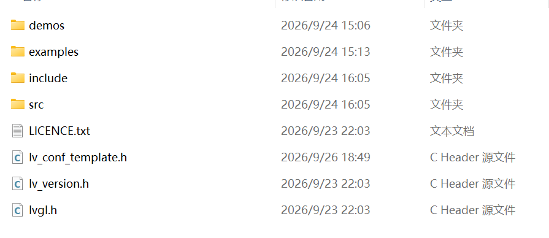
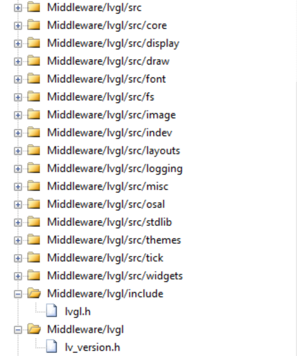
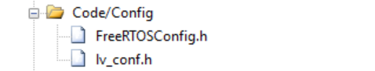
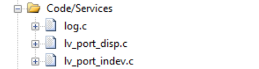
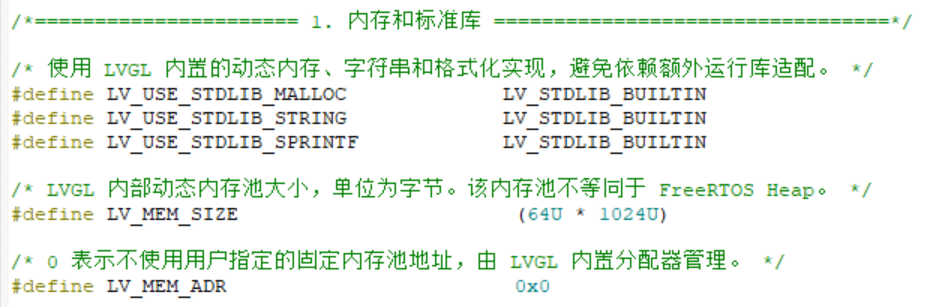
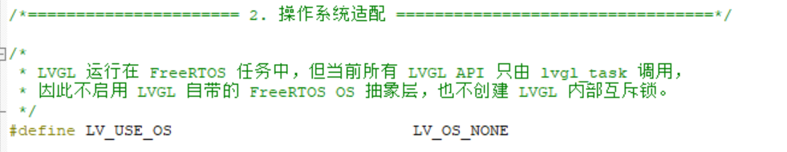
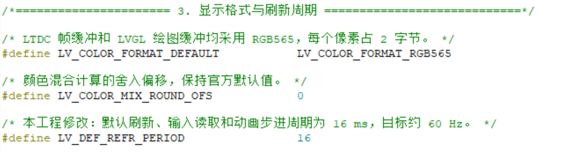
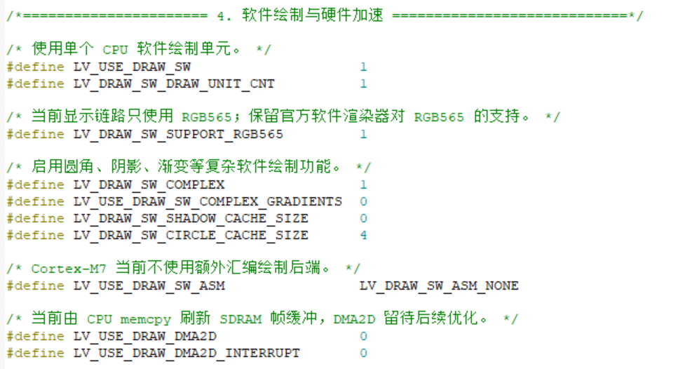
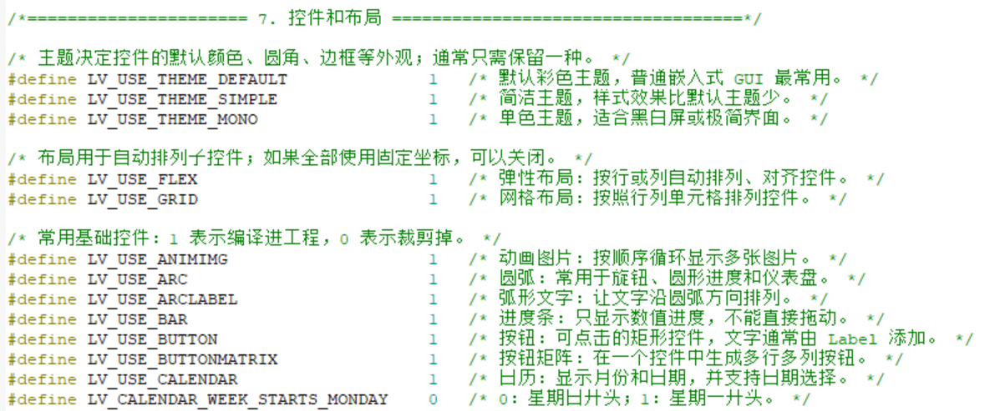

# LVGL 9.6 移植记录

本文记录将 LVGL v9.6.0 移植到 STM32 工程的过程。本工程使用 Keil MDK、FreeRTOS、LTDC 和外部 SDRAM，显示颜色格式为 RGB565。

## 1. 下载 LVGL 源码

本工程使用固定版本 **LVGL v9.6.0**，完整源码下载地址如下：

[下载 LVGL v9.6.0 完整源码](https://github.com/lvgl/lvgl/archive/refs/tags/v9.6.0.zip)

该链接会直接下载 `lvgl-9.6.0.zip`。下载完成后解压，可得到如下源码目录：

```text
lvgl-9.6.0/
```

建议保留最初下载的压缩包和解压后的原始源码，移植时从原始源码中复制所需文件，不要直接在原始源码目录中修改。

## 2. 将所需文件复制到 Middleware 目录

在 STM32 工程的 `Middleware` 目录中新建 `Lvgl` 文件夹，然后从解压后的 `lvgl-9.6.0` 目录中复制所需文件。

本工程中的目标路径为：

```text
GUI/
└─ Middleware/
   └─ Lvgl/
```



各目录和文件的用途如下：

| 文件或目录                | 是否必须 | 作用                             |
| -------------------- | ----:| ------------------------------ |
| `src/`               | 必须   | LVGL 的核心源代码                    |
| `include/`           | 必须   | LVGL 9.6 的公共 API 头文件           |
| `lvgl.h`             | 必须   | LVGL 对外使用的总入口头文件               |
| `lv_version.h`       | 建议保留 | LVGL 版本信息入口头文件                 |
| `lv_conf_template.h` | 必须复制 | LVGL 官方配置模板，复制后改名为 `lv_conf.h` |
| `examples/porting/`  | 按需   | 官方显示设备、输入设备及操作系统移植模板           |
| `demos/`             | 可选   | LVGL 官方综合演示，例如 Widgets Demo    |
| `LICENCE.txt`        | 建议保留 | LVGL 软件许可证                     |

下载得到的源码中提供的是 `lv_conf_template.h`。复制该文件到 `Middleware/Lvgl` 后，将副本重命名为：

```text
lv_conf.h
```

不要修改原始下载目录中的 `lv_conf_template.h`。后续所有配置均在工程内的 `lv_conf.h` 中完成。

本工程将修改后的 `lv_conf.h` 放在 `Code/0-Config` 中，而不是继续放在 `Middleware/Lvgl` 中。`Middleware/Lvgl/lv_conf_template.h` 保留为原始配置模板。

## 3. 在 Keil 中建立分组并添加文件

Keil 中的 Group 是虚拟分组，只用于组织和显示文件，不会改变文件在磁盘中的实际位置。本工程按照“第三方库、配置、服务”进行分层：

- LVGL 官方源码放在 `Middleware/lvgl` 分组。
- 工程配置文件 `lv_conf.h` 放在 `Code/Config` 分组。
- 修改完成的显示和输入移植文件放在 `Code/Services` 分组。

### 3.1 添加 LVGL 源文件

根据 `src` 的目录结构建立对应分组，并把需要参与编译的 `.c` 文件加入 Keil：



本工程加入了以下源码分组：

```text
Middleware/lvgl/src
Middleware/lvgl/src/core
Middleware/lvgl/src/display
Middleware/lvgl/src/draw
Middleware/lvgl/src/font
Middleware/lvgl/src/fs
Middleware/lvgl/src/image
Middleware/lvgl/src/indev
Middleware/lvgl/src/layouts
Middleware/lvgl/src/logging
Middleware/lvgl/src/misc
Middleware/lvgl/src/osal
Middleware/lvgl/src/stdlib
Middleware/lvgl/src/themes
Middleware/lvgl/src/tick
Middleware/lvgl/src/widgets
```

其中根分组 `Middleware/lvgl/src` 中需要加入 `src/lvgl.c`。

不要直接把 `src` 下的所有源码无选择地加入工程。当前工程没有使用以下功能，因此没有加入相应实现：

- `src/drivers` 中的通用显示、Linux 等驱动；
- `src/libs` 中依赖第三方库的功能；
- `src/others` 和调试测试模块；
- DMA2D、OpenGL、VG-Lite 等当前未启用的硬件绘制后端。

`draw`、`stdlib` 等目录内部也只加入当前配置需要的通用软件实现。后续在 `lv_conf.h` 中启用新功能时，再补充它依赖的源码或第三方库。

### 3.2 添加公共头文件

`include/` 目录必须保留在磁盘中，因为它包含 LVGL 9.6 的公共 API。Keil 需要添加以下头文件搜索路径：

```text
..\Middleware\Lvgl
..\Middleware\Lvgl\include
```

应用代码统一使用：

```c
#include "lvgl.h"
```

头文件不会独立参与编译，因此不需要把 `include` 中的所有 `.h` 文件逐个加入 Keil 工程树。图中只加入 `include/lvgl/lvgl.h`，目的是方便在 Keil 中查看公共 API。

根目录的 `lv_version.h` 是版本信息入口文件，可以保留在 `Middleware/lvgl` 分组中方便查看，但不要求单独加入 Keil。真正参与包含的版本头文件已经位于 `include/lvgl/lv_version.h` 中。

### 3.3 将 `lv_conf.h` 放入配置层

将 `lv_conf_template.h` 复制为 `lv_conf.h`，修改完成后放入：

```text
Code/0-Config/lv_conf.h
```

并在 Keil 中加入 `Code/Config` 分组：



确保 Keil 的 Include Paths 中已经包含：

```text
..\Code\0-Config
```

建议同时在 Keil 的预处理宏中添加：

```text
LV_CONF_INCLUDE_SIMPLE
```

这样 LVGL 内部可直接通过 `#include "lv_conf.h"` 找到工程配置文件。

### 3.4 将移植接口放入服务层

从 `examples/porting` 复制显示和输入设备模板，修改完成后分别重命名为：

```text
lv_port_disp.c
lv_port_disp.h
lv_port_indev.c
lv_port_indev.h
```

本工程将这些文件放在：

```text
Code/2-Services/LVGL/
```

并将需要编译的 `.c` 文件加入 `Code/Services` 分组：



文件重命名后，还需要同步修改源码中的头文件包含关系：

```c
/* lv_port_disp.c */
#include "lv_port_disp.h"

/* lv_port_indev.c */
#include "lv_port_indev.h"
```

不能继续包含模板文件名：

```c
#include "lv_port_disp_template.h"
#include "lv_port_indev_template.h"
```

如果应用代码需要直接包含端口头文件，还应将下面的目录加入 Include Paths：

```text
..\Code\2-Services\LVGL
```

本工程当前已经加入电容触摸。显示端口使用 `lv_port_disp.c`，输入端口使用 `lv_port_indev.c`。官方模板中未使用的鼠标、键盘、编码器和外部按钮示例已经移除，文件内只保留本开发板实际使用的电容触摸适配。

### 3.5 Port 与 App 文件内部组织规范

为了区分模块接口和内部实现，本工程的 Port 文件以及 App 层实际参与显示的文件统一按以下顺序组织：

```text
头文件包含
宏、类型定义
static 私有函数前置声明
static 私有数据
公共函数（集中放置并使用分隔框标出）
static 私有函数实现（集中放在公共函数之后）
```

每个 `.c` 和 `.h` 文件顶部先用 `@file`、`@brief` 说明文件内容及主要职责。`.c` 文件中的公共函数必须和私有函数分区放置。公共函数位于上方，供公共函数调用的 `static` 辅助函数只在上方声明，其函数体统一放到下方的“私有函数”区域。这样打开文件后可以先看到模块向外提供了哪些能力，再查看实现细节。

`.h` 文件只声明其他模块可以调用的接口。每个接口至少注明：

- 函数的作用；
- 调用前置条件和调用顺序；
- 当前工程中的调用文件或当前是否尚无调用者；
- 一条简短的调用示例。

例如，`lv_port_disp_init()` 的注释会明确指出它由 `Core/Src/main.c` 的 `lvgl_task()` 在 `lv_init()` 之后调用；刷新回调 `disp_flush()` 属于本文件私有实现，因此只在 `.c` 文件中声明和定义，不暴露在头文件中。

## 4. 修改 lv_conf.h

`lv_conf.h` 用于配置 LVGL 的内存、显示格式、绘制方式和功能裁剪。本工程只显式配置需要关注的选项，其余选项采用 LVGL 9.6 的内部默认值。

### 4.1 内存池和标准库



本工程使用 LVGL 内置的 TLSF 内存管理器，并分配 64 KB 专用内存池：

```c
#define LV_USE_STDLIB_MALLOC  LV_STDLIB_BUILTIN
#define LV_MEM_SIZE           (64U * 1024U)
#define LV_MEM_ADR            0x0
```

`LV_MEM_ADR` 为 `0` 时，LVGL 使用静态数组建立内存池。该内存池用于控件、样式和动画等动态对象，与 FreeRTOS Heap、绘图缓冲和 LTDC 帧缓冲相互独立。

### 4.2 操作系统适配



```c
#define LV_USE_OS LV_OS_NONE
```

工程虽然运行 FreeRTOS，但所有 LVGL API 都集中在同一个 `lvgl_task` 中调用，因此暂不启用 LVGL 自带的 FreeRTOS OS 抽象层。`LV_OS_NONE` 不表示工程没有使用 FreeRTOS。

### 4.3 显示格式和刷新周期



```c
#define LV_COLOR_FORMAT_DEFAULT  LV_COLOR_FORMAT_RGB565
#define LV_DEF_REFR_PERIOD       16
```

RGB565 与 LTDC 帧缓冲格式一致，每个像素占 2 字节；16 ms 刷新周期对应约 60 Hz。LVGL 9 的分辨率不在 `lv_conf.h` 中固定，而是由 LTDC 获取屏幕宽高后传给：

```c
lv_display_create(hor_res, ver_res);
```

### 4.4 软件绘制与硬件加速



当前使用 Cortex-M7 CPU 进行软件绘制，并由 CPU 将绘图缓冲复制到 SDRAM 帧缓冲：

```c
#define LV_USE_DRAW_SW             1
#define LV_DRAW_SW_DRAW_UNIT_CNT   1
#define LV_DRAW_SW_SUPPORT_RGB565  1
#define LV_DRAW_SW_COMPLEX         1
#define LV_USE_DRAW_DMA2D          0
```

DMA2D 尚未接入 LVGL，因此保持关闭。后续完成 DMA2D 刷新和缓存一致性处理后再启用。

### 4.5 主题、布局和控件裁剪



上图是裁剪前的配置。根据当前界面代码，最终只保留默认主题和实际使用的控件：

```c
#define LV_USE_THEME_DEFAULT  1
#define LV_USE_ARC            1
#define LV_USE_BUTTON         1
#define LV_USE_IMAGE          1
#define LV_USE_LABEL          1
```

`Arc` 用于圆弧进度，`Button` 用于页面和工具栏按钮，`Label` 用于文字及符号图标。`Image` 当前保留，便于后续加入图片资源；实际触摸输入端口 `lv_port_indev.c` 本身不依赖 Image 控件。

当前没有使用 Flex、Grid、Chart、Canvas、Slider、Table 等模块，对应宏设置为 `0`，可以减少编译生成的代码。

### 4.6 关闭官方例程和暂未使用的功能

工程不运行 LVGL 官方例程，因此关闭总开关：

```c
#define LV_BUILD_EXAMPLES  0
#define LV_BUILD_DEMOS     0
```

文件系统、PNG/JPEG/GIF 解码、FreeType、Linux/SDL 驱动和其他硬件绘制后端当前也保持关闭。后续使用 SD 卡图片或新增控件时，再开启对应宏并补充依赖源码。

> LVGL 的 1 ms 时基不在 `lv_conf.h` 中配置。本工程由 TIM7 中断调用 `lv_tick_inc(1)`，任务中周期调用 `lv_timer_handler()`；显示任务中的完整调用关系将在第 5 章说明。

## 5. 配置显示 Port 与显示任务

显示 Port 位于 LVGL 与 LCD 设备层之间，主要解决两个问题：

- LVGL 使用哪块内存作为临时绘制缓冲区；
- LVGL 绘制好的 RGB565 像素怎样送到 LTDC 的 SDRAM 帧缓冲区。

### ⭐ 显示 Port 核心说明

| **LVGL 显示数据流（本章最重要的内容）** |
| :--- |
| **LVGL 创建显示对象并绘制界面 → 片内 SRAM 中的 `s_draw_buf` → `disp_flush()` 刷新回调 → SDRAM 中的 LTDC 帧缓冲区 → LTDC 扫描输出到 LCD** |
| 该部分负责创建 LVGL 显示对象、设置显示分辨率和 RGB565 颜色格式，并配置 LVGL 的局部绘制缓冲区。`disp_flush()` 是连接 LVGL 与实际 LCD 显示的关键接口。 |

本工程的显示 Port 文件是：

```text
Code/2-Services/LVGL/
├─ lv_port_disp.c
└─ lv_port_disp.h
```

### 5.1 显示 Port 的作用

显示 Port 不负责初始化 SDRAM 和 LTDC。工程在进入 LVGL 任务以前已经完成：

```text
sdram_init()
    ↓
lcd_init()
    ↓
创建FreeRTOS任务
    ↓
lv_init()
    ↓
lv_port_disp_init()
```

`lv_port_disp_init()` 的任务是创建 LVGL 显示对象，指定分辨率和颜色格式，提供绘制缓冲区，并把 `disp_flush()` 注册为刷新回调。

### 5.2 配置局部绘制缓冲区

本工程屏幕使用 RGB565，每个像素占 2 字节。绘制缓冲区最多保存 120 行：

```c
/** LVGL局部绘制缓冲区可同时容纳的屏幕行数。 */
#define LVGL_DRAW_BUF_LINES 120U

LV_ATTRIBUTE_MEM_ALIGN
static uint16_t s_draw_buf[
    LCD_FRAMEBUFFER_MAX_WIDTH * LVGL_DRAW_BUF_LINES
];
```

缓冲区的实际有效字节数按照当前面板宽度计算：

```c
draw_buf_size = (uint32_t)hor_res *
                LVGL_DRAW_BUF_LINES *
                sizeof(uint16_t);
```

随后注册为单缓冲、局部渲染模式：

```c
lv_display_set_buffers(disp,
                       s_draw_buf,
                       NULL,
                       draw_buf_size,
                       LV_DISPLAY_RENDER_MODE_PARTIAL);
```

其中：

- `s_draw_buf` 是第一个绘制缓冲区；
- `NULL` 表示没有第二个绘制缓冲区；
- `LV_DISPLAY_RENDER_MODE_PARTIAL` 表示分块绘制，不要求准备整屏大小的 LVGL 缓冲区；
- 该缓冲区不是 LTDC 帧缓冲，绘制完成后还需要通过 `disp_flush()` 复制到 SDRAM 帧缓冲。

如果屏幕宽度为 800 像素，缓冲区实际需要：

```text
800 × 120 × 2 = 192000 Byte
```

### 5.3 初始化 LVGL 显示对象

显示初始化函数的核心代码如下：

```c
void lv_port_disp_init(void)
{
    uint16_t hor_res;
    uint16_t ver_res;
    uint32_t draw_buf_size;

    disp_init();

    if (!lcd_is_ready())
    {
        return;
    }

    hor_res = lcd_get_width();
    ver_res = lcd_get_height();
    if (hor_res == 0U || ver_res == 0U ||
        hor_res > LCD_FRAMEBUFFER_MAX_WIDTH)
    {
        return;
    }

    lv_display_t *disp = lv_display_create(hor_res, ver_res);
    if (disp == NULL)
    {
        return;
    }

    lv_obj_set_size(lv_display_get_screen_active(disp),
                    hor_res, ver_res);
    lv_display_set_color_format(disp, LV_COLOR_FORMAT_RGB565);
    lv_display_set_flush_cb(disp, disp_flush);

    draw_buf_size = (uint32_t)hor_res *
                    LVGL_DRAW_BUF_LINES *
                    sizeof(uint16_t);
    lv_display_set_buffers(disp, s_draw_buf, NULL,
                           draw_buf_size,
                           LV_DISPLAY_RENDER_MODE_PARTIAL);
}
```

各调用的作用如下：

| 调用                               | 作用                            |
| -------------------------------- | ----------------------------- |
| `lcd_is_ready()`                 | 确认 SDRAM、LTDC 和 LCD 设备已经初始化成功 |
| `lcd_get_width()`                | 从 LCD 设备层取得当前面板宽度             |
| `lcd_get_height()`               | 从 LCD 设备层取得当前面板高度             |
| `lv_display_create()`            | 在 LVGL 内部创建显示对象和刷新定时器         |
| `lv_display_get_screen_active()` | 取得当前显示器的活动屏幕对象                |
| `lv_display_set_color_format()`  | 指定 Port 与 LCD 都使用 RGB565      |
| `lv_display_set_flush_cb()`      | 保存刷新回调地址，供 LVGL 内部刷新流程调用      |
| `lv_display_set_buffers()`       | 设置绘制缓冲区大小、数量和渲染模式             |

### 5.4 显示 Port 中每个函数的功能

| 函数                      | 谁调用                   | 调用位置或时机                                                    | 功能                          |
| ----------------------- | --------------------- | ---------------------------------------------------------- | --------------------------- |
| `lv_port_disp_init()`   | 本工程 LVGL 任务           | `Core/Src/main.c` 的 `lvgl_task()`，紧跟在 `lv_init()` 后        | 创建并配置 LVGL display，只调用一次    |
| `disp_init()`           | `lv_port_disp_init()` | 显示 Port 初始化开始时                                             | 预留的底层准备接口；当前硬件已提前初始化，所以函数为空 |
| `disp_flush()`          | LVGL 内部刷新流程           | `lv_timer_handler()`处理显示刷新定时器时，经 `src/core/lv_refr.c` 间接调用 | 把一块 RGB565 像素复制到 LTDC 帧缓冲   |
| `disp_enable_update()`  | 当前没有调用者               | 需要恢复屏幕写入时由应用主动调用                                           | 允许 `disp_flush()`写入帧缓冲      |
| `disp_disable_update()` | 当前没有调用者               | 需要临时冻结屏幕画面时由应用主动调用                                         | 暂停帧缓冲写入，但不会停止 LVGL 计算       |

`lv_port_disp_init()` 是应用主动调用的初始化函数，`disp_flush()` 则是回调函数。注册回调的代码为：

```c
lv_display_set_flush_cb(disp, disp_flush);
```

这句代码只是把函数指针保存到 LVGL 显示对象中，并不会立即执行 `disp_flush()`。

### 5.5 `disp_flush()` 是怎样被调用的

本工程的显示刷新调用链如下：

```text
FreeRTOS中的lvgl_task()
    ↓ 主动周期调用
lv_timer_handler()
    ↓ 执行LVGL显示刷新定时器
LVGL对象布局和软件绘制
    ↓ 绘制到s_draw_buf
src/core/lv_refr.c中的call_flush_cb()
    ↓ 调用已注册的函数指针
disp_flush(disp, area, px_map)
    ↓
lcd_write_area(...)
    ↓
CPU将RGB565像素复制到SDRAM中的LTDC帧缓冲
    ↓
lv_display_flush_ready(disp)
```

刷新回调代码如下：

```c
static void disp_flush(lv_display_t *disp,
                       const lv_area_t *area,
                       uint8_t *px_map)
{
    if (s_flush_enabled && area->x1 >= 0 && area->y1 >= 0)
    {
        lcd_write_area((uint16_t)area->x1,
                       (uint16_t)area->y1,
                       (uint16_t)area->x2,
                       (uint16_t)area->y2,
                       (const uint16_t *)px_map);
    }

    lv_display_flush_ready(disp);
}
```

三个参数的含义：

| 参数       | 含义                            |
| -------- | ----------------------------- |
| `disp`   | 发起本次刷新的 LVGL 显示对象             |
| `area`   | 本次需要更新的矩形，`x2`、`y2` 是包含式右下角坐标 |
| `px_map` | LVGL 已经绘制完成的 RGB565 像素数组      |

当前 `lcd_write_area()` 使用 CPU 同步复制。因此函数返回前传输已经完成，可以立即调用：

```c
lv_display_flush_ready(disp);
```

该调用非常重要，它告诉 LVGL：绘制缓冲区已经可以再次使用。如果漏掉，LVGL 会一直认为刷新尚未完成，之后不再正常复用缓冲区。

以后将 `lcd_write_area()` 改为 DMA2D 异步传输时，不能在启动 DMA2D 后立即调用 `lv_display_flush_ready()`，而应当在 DMA2D 传输完成中断中调用。


### 5.6 创建并运行 LVGL 显示任务

本工程在一个独立的 FreeRTOS 任务中初始化并持续驱动 LVGL。显示相关的基本结构如下：

```c
static void lvgl_task(void *param)
{
    uint32_t delay_ms;

    (void)param;

    /* 1. 初始化LVGL核心。 */
    lv_init();

    /* 2. 创建默认显示器，注册绘制缓冲区和disp_flush()。 */
    lv_port_disp_init();

    if (lv_display_get_default() == NULL)
    {
        Error_Handler();
    }

    /* 3. 创建页面、按钮、波形等应用对象。 */
    wave_init(lv_screen_active());
    side_panel_create(lv_screen_active());

    for (;;)
    {
        /* 4. 处理LVGL软件定时器、失效区域、绘制和flush。 */
        delay_ms = lv_timer_handler();

        if (delay_ms < 1U)
        {
            delay_ms = 1U;
        }

        vTaskDelay(pdMS_TO_TICKS(delay_ms));
    }
}
```

显示初始化顺序为：

```text
SDRAM、MPU、LTDC和LCD初始化
    ↓
创建FreeRTOS任务
    ↓
lv_init()
    ↓
lv_port_disp_init()
    ↓
创建页面和控件
    ↓
循环调用lv_timer_handler()
```

当前 `LV_USE_OS` 为 `LV_OS_NONE`，因此应尽量只在 LVGL 任务中调用 LVGL API。采样中断和其他任务只负责准备数据，再通过队列、任务通知或共享状态交给 LVGL 任务更新界面。

### 5.7 Tick、任务调度和显示刷新不是一回事

本工程由 TIM7 每 1 ms 提供 LVGL 时间基准：

```c
if (htim->Instance == TIM7)
{
    lv_tick_inc(1);
}
```

TIM7 中断只增加 LVGL 内部时间，不会在中断中绘制界面，也不会直接调用对象绘制回调或 `disp_flush()`。真正执行 LVGL 工作的是任务中的：

```c
lv_timer_handler();
```

三个时间过程应当分开理解：

| 过程 | 当前配置 | 作用 |
| --- | ---: | --- |
| TIM7 硬件中断 | 1 ms | 调用 `lv_tick_inc(1)`，只提供时间基准 |
| LVGL 显示刷新软件定时器 | 默认 16 ms | 有失效区域时安排布局、绘制和刷新 |
| LTDC 硬件扫描 | 由面板时序决定 | 持续读取 SDRAM 帧缓冲并输出到 RGB 屏 |

`LV_DEF_REFR_PERIOD=16` 不代表每 16 ms 无条件重画全部对象。没有失效区域时，不会执行对象绘制回调，也不会调用 `disp_flush()`。

### 5.8 对象什么时候需要重新绘制

创建对象以及修改位置、大小、文本、样式、状态和标准控件值时，LVGL API 通常会自动使相应对象失效，例如：

```c
lv_label_set_text(label, "运行中");
lv_arc_set_value(arc, 50);
lv_obj_set_pos(obj, 100, 50);
lv_obj_add_state(button, LV_STATE_CHECKED);
```

这些标准接口内部会通知 LVGL 对象内容已经变化，一般不需要再次手动调用 `lv_obj_invalidate()`。

对于波形等自定义绘图对象，绘图内容来自工程自己维护的普通 C 数据：

```c
channel->render.points;
channel->render.point_count;
s_wave.view;
```

LVGL 无法监视这些变量，因此数据准备完成后必须主动使对象失效：

```c
wave_prepare_channel(channel, &s_wave.view);
lv_obj_invalidate(channel->render.wave_obj);
```

`lv_obj_invalidate()` 只表示“这个对象下一次需要重新绘制”，不会在该函数内部立即绘图。

### 5.9 `area` 是怎样产生的

LVGL 保存了每个对象布局后的屏幕坐标。对象失效时，会先以对象坐标及阴影等扩展绘制范围作为原始失效区域，然后完成：

1. 与显示器边界相交，裁掉屏幕外部分；
2. 合并重叠或相邻且适合合并的失效区域；
3. 删除已经被其他区域完整包含的区域；
4. 根据绘制缓冲区容量把过大的区域拆成多个子区域。

最终正在绘制的子区域就是传给 `disp_flush()` 的 `area`：

```c
area->x1;  /* 左上角X */
area->y1;  /* 左上角Y */
area->x2;  /* 右下角X，包含该像素 */
area->y2;  /* 右下角Y，包含该像素 */
```

`area` 不是 LVGL 在绘制结束后统计“哪些像素被使用”得到的，而是在进入对象绘制回调前就已经由失效区域确定。

### 5.10 标准控件绘制与自定义绘制回调

Label、Button、Arc 等标准控件已经包含 LVGL 内部绘制代码，应用只需创建对象并修改属性，不需要自己注册绘制回调。

波形和自定义图标需要使用自绘事件。例如时间标尺注册：

```c
lv_obj_add_event_cb(s_wave.time_ruler,
                    wave_draw_time_ruler_cb,
                    LV_EVENT_DRAW_MAIN,
                    NULL);
```

注册只保存函数地址，并不会让回调按照固定频率执行。只有对象已经失效且 LVGL 正在绘制与该对象相交的区域时，才会发送 `LV_EVENT_DRAW_MAIN` 并调用回调。

自定义绘制回调通常完成以下工作：

```c
static void wave_draw_time_ruler_cb(lv_event_t *event)
{
    lv_layer_t *layer = lv_event_get_layer(event);
    lv_area_t coords;
    lv_draw_line_dsc_t line_dsc;

    lv_obj_get_content_coords(lv_event_get_current_target(event),
                              &coords);

    lv_draw_line_dsc_init(&line_dsc);
    line_dsc.color = lv_color_hex(0xFFFFFFU);
    line_dsc.width = 1U;

    /* 根据已准备好的坐标设置p1和p2。 */
    lv_draw_line(layer, &line_dsc);
}
```

绘制回调负责读取已经准备好的数据，并调用 `lv_draw_line()`、`lv_draw_label()`、`lv_draw_rect()` 等 LVGL 绘图 API。LVGL 软件绘制器再根据当前 `layer` 的缓冲区、偏移和裁剪范围，把最终 RGB565 像素写入 `s_draw_buf`。

绘制回调中不应执行慢速硬件读取、长时间算法、任务延时或再次使对象失效。它还可能因为局部渲染分块而在一次界面更新中执行多次，所以应保证使用相同输入数据重复执行也能得到相同结果。

### 5.11 `wave_refresh()` 与绘制回调的分工

`wave_refresh()` 不直接写像素，它负责准备绘图数据和请求重绘：

```c
void wave_refresh(uint32_t timer_now_cnt)
{
    wave_update_view(relative_now_cnt);
    lv_obj_invalidate(s_wave.time_ruler);

    for (channel_index = 0U;
         channel_index < WAVE_CHANNEL_COUNT;
         ++channel_index)
    {
        wave_channel_t *channel =
            &s_wave.channels[channel_index];

        wave_prepare_channel(channel, &s_wave.view);
        lv_obj_invalidate(channel->render.wave_obj);
    }
}
```

职责关系如下：

```text
wave_refresh()
    ├─ 更新时间窗口
    ├─ 把边沿Tick转换为波形点坐标
    └─ lv_obj_invalidate()
             ↓
LVGL显示刷新流程
             ↓
wave_draw_time_ruler_cb() / wave_draw_channel_cb()
    ├─ 取得当前layer和对象坐标
    └─ 调用lv_draw_line()、lv_draw_label()
             ↓
LVGL软件绘制器把像素写入s_draw_buf
```

### 5.12 超过绘制缓冲区容量时的分块处理

对于 800×480 的 RGB565 屏幕，120 行缓冲区只能容纳：

```text
800 × 120 × 2 = 192000 Byte
```

如果整屏失效，LVGL 会分成多个子区域，例如：

```text
第1块：(0,   0) ～ (799, 119)
第2块：(0, 120) ～ (799, 239)
第3块：(0, 240) ～ (799, 359)
第4块：(0, 360) ～ (799, 479)
```

每个子区域都复用同一个 `s_draw_buf`：

```text
绘制第1块到s_draw_buf → disp_flush() → flush_ready()
    ↓ 复用同一缓冲区
绘制第2块到s_draw_buf → disp_flush() → flush_ready()
    ↓
直到全部区域完成
```

如果一条线跨越多个子区域，绘制回调可以每次提交完整线段；LVGL 根据当前 `layer` 的裁剪区域，只将落在当前分块中的部分写入缓冲区。一次 `disp_flush()` 表示一个局部矩形块完成，不一定表示完整一帧完成。

120 行也不是所有情况下固定的分块高度。LVGL 会根据当前失效区域宽度和缓冲区总字节数动态计算可容纳的最大行数；区域越窄，同一缓冲区可能容纳越多行。

### 5.13 从对象变化到 LCD 显示的完整调用链

```text
业务代码或触摸事件修改界面数据
    ↓
标准LVGL API自动失效，或自绘对象手动lv_obj_invalidate()
    ↓
lv_timer_handler()处理显示刷新软件定时器
    ↓
LVGL计算、合并并按缓冲区容量拆分失效区域
    ↓
调用标准控件内部绘制代码和自定义LV_EVENT_DRAW_MAIN回调
    ↓
LVGL软件绘制器把当前area的RGB565像素写入s_draw_buf
    ↓
src/core/lv_refr.c中的call_flush_cb()
    ↓
disp->flush_cb(disp, area, px_map)
    ↓ 等效于调用已注册的函数
disp_flush(disp, area, px_map)
    ↓
lcd_write_area()把局部像素复制到SDRAM中的正确位置
    ↓
lv_display_flush_ready(disp)
    ↓
LTDC持续扫描完整SDRAM帧缓冲并输出到LCD
```

当前波形更新还会在 `wave_refresh()` 使对象失效后调用：

```c
lv_refr_now(lv_display_get_default());
```

它会立即处理当前失效区域，不等待默认 16 ms 刷新调度周期。

## 6. 配置触摸输入 Port

### 6.1 本工程实际使用的输入 Port

LVGL 把触摸屏、鼠标、键盘和编码器统称为输入设备，即 indev。本工程目前只使用电容触摸，因此在官方 Port 文件中删除了其他输入设备模板，只保留实际需要的触摸适配：

```text
lv_port_indev.c
```

它在 LVGL 中注册为：

```c
LV_INDEV_TYPE_POINTER
```

也就是带有坐标和按下/释放状态的指针设备。

初始化入口如下：

```c
void lv_port_indev_init(void)
{
    lv_display_t *display = lv_display_get_default();
    touch_config_t config;

    config.width = lv_display_get_horizontal_resolution(display);
    config.height = lv_display_get_vertical_resolution(display);
    s_ready = (touch_init(&config) == TOUCH_STATUS_OK);
    s_last_point.x = 0;
    s_last_point.y = 0;
    s_indev = NULL;

    if (!s_ready)
    {
        return;
    }

    s_indev = lv_indev_create();
    if (s_indev == NULL)
    {
        s_ready = false;
        return;
    }

    lv_indev_set_type(s_indev, LV_INDEV_TYPE_POINTER);
    lv_indev_set_read_cb(s_indev, indev_read_cb);
}
```

其中：

| 调用                       | 作用                       |
| ------------------------ | ------------------------ |
| `touch_init()`           | 初始化控制器，保存显示尺寸，供 Device 层转换和裁剪坐标 |
| `lv_indev_create()`      | 创建 LVGL 输入对象，同时创建周期读取定时器 |
| `lv_indev_set_type()`    | 把输入对象声明为触摸/鼠标类 pointer   |
| `lv_indev_set_read_cb()` | 保存触摸读取回调，供 LVGL 输入定时器调用  |

### 6.2 输入 Port 中每个函数的功能

| 函数                         | 谁调用                      | 调用位置或时机                                            | 功能                              |
| -------------------------- | ------------------------ | -------------------------------------------------- | ------------------------------- |
| `lv_port_indev_init()`     | 本工程 LVGL 任务         | `Core/Src/main.c` 的 `lvgl_task()`，在显示对象创建后 | 初始化触摸设备并向 LVGL 注册 pointer，只调用一次 |
| `indev_read_cb()`          | LVGL 输入设备定时器       | `src/indev/lv_indev.c` 的 `lv_indev_read()` 通过函数指针调用 | 读取触摸状态，向 LVGL 返回坐标和按下/释放状态 |
| `touch_read_point()`       | `indev_read_cb()`        | LVGL 周期读取输入设备时 | Device 层读取控制器并返回已经转换、裁剪的屏幕坐标 |
| `lv_port_indev_is_ready()` | 当前没有调用者           | 应用需要查询触摸是否可用时 | 返回触摸控制器和 LVGL 输入对象是否初始化成功 |

### 6.3 输入读取回调是怎样被调用的

注册输入对象时执行：

```c
s_indev = lv_indev_create();
lv_indev_set_type(s_indev, LV_INDEV_TYPE_POINTER);
lv_indev_set_read_cb(s_indev, indev_read_cb);
```

`lv_indev_create()` 会在 LVGL 内部为该输入设备创建一个读取定时器。随后调用链为：

```text
FreeRTOS中的lvgl_task()
    ↓
lv_timer_handler()
    ↓ 执行输入设备读取定时器
lv_indev_read_timer_cb()
    ↓
lv_indev_read()
    ↓ 调用indev->read_cb函数指针
indev_read_cb(indev, data)
    ↓
touch_read_point(&point)
    ↓
设备层读取 GT9xxx 或 FT5206，并转换为有效屏幕坐标
    ↓
LVGL根据data中的坐标和状态产生点击、按下、释放等事件
```

输入回调的核心代码如下：

```c
static void indev_read_cb(lv_indev_t *indev,
                          lv_indev_data_t *data)
{
    touch_point_t point;
    (void)indev;

    data->continue_reading = false;
    data->point = s_last_point;

    if (!s_ready || !touch_read_point(&point))
    {
        data->state = LV_INDEV_STATE_RELEASED;
        s_pointer_down = false;
        return;
    }

    s_last_point.x = point.x;
    s_last_point.y = point.y;
    data->point = s_last_point;
    data->state = LV_INDEV_STATE_PRESSED;
    s_pointer_down = true;
}
```

需要写入 `lv_indev_data_t` 的主要字段为：

| 字段                       | 本工程设置                  | 作用                    |
| ------------------------ | ---------------------- | --------------------- |
| `data->point`            | 当前坐标或最后一次有效坐标          | 告诉 LVGL 指针位于屏幕的哪个位置   |
| `data->state`            | `PRESSED` 或 `RELEASED` | 告诉 LVGL 当前是否按下        |
| `data->continue_reading` | `false`                | 表示本次没有更多缓存的触摸数据需要立即读取 |

释放时继续返回最后一次有效坐标是正常做法。这样 LVGL 能够在正确的位置完成释放、点击和短按判断。

### 6.4 触摸 Port 在 LVGL 任务中的初始化位置

触摸输入必须在 `lv_init()` 和默认显示器创建完成后注册：

```c
lv_init();
lv_port_disp_init();

if (lv_display_get_default() == NULL)
{
    Error_Handler();
}

lv_port_indev_init();
```

顺序不能交换，因为 `lv_indev_create()` 会把新输入设备关联到当前默认显示器；初始化 Device 层触摸模块时，也要把该显示器的实际分辨率传给 `touch_init()`。

`indev_read_cb()` 不需要在任务中手动调用。它在初始化时注册为函数指针，随后由 `lv_timer_handler()` 驱动的输入设备软件定时器间接调用。

### 6.5 `lv_port_indev.c` 的精简结果

当前工程只保留一套输入 Port。`lv_port_indev.c` 已从官方通用模板精简为电容触摸实现：

- Keil 只编译 `lv_port_indev.c`；
- `main.c` 只调用 `lv_port_indev_init()`；
- 鼠标、键盘、编码器和外部按钮模板已经移除；
- Device 层 `touch.c` 负责控制器操作、坐标方向转换和边界裁剪；Services 层 `lv_port_indev.c` 只负责转换为 LVGL 输入数据。

因此当前运行关系为：

```text
Device/touch.c
    ↓ 已转换、裁剪的屏幕坐标
Services/LVGL/lv_port_indev.c
    ↓ lv_indev_data_t
LVGL 输入设备与事件系统
```
